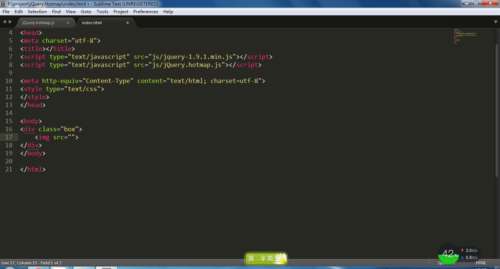

hotmap
======

一个简单的  jQuery图片热点制作 插件
======
#usage
======
        var m=$("#img1").hotmap() 
    可以手动的设置初始热区 如:
    var map=$(".img1").load(function() {
        $(".img1").Hotmap({
            maps:[{
            pos:[22,44,544,355],
            link:"http:123.com",
            title:"123"
        },{pos:[220,441,544,200],
            link:"http:789.com",
            title:"789"
        },{pos:[555,100,544,355],
            link:"http:456.com",
            title:"456"
        }]
        });
    })

    map.maps得到所绘制的热区坐标与 链接  标题    